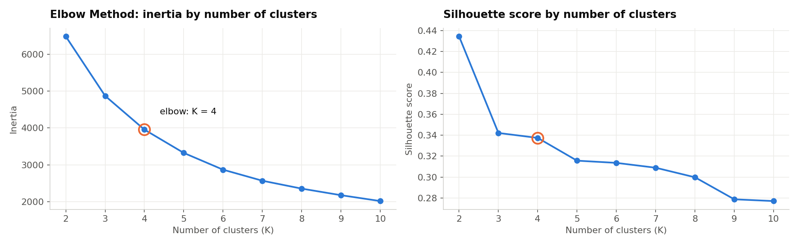
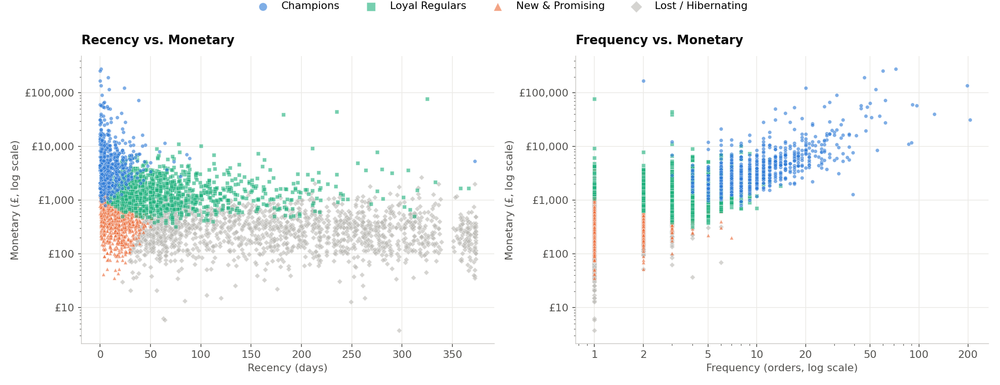
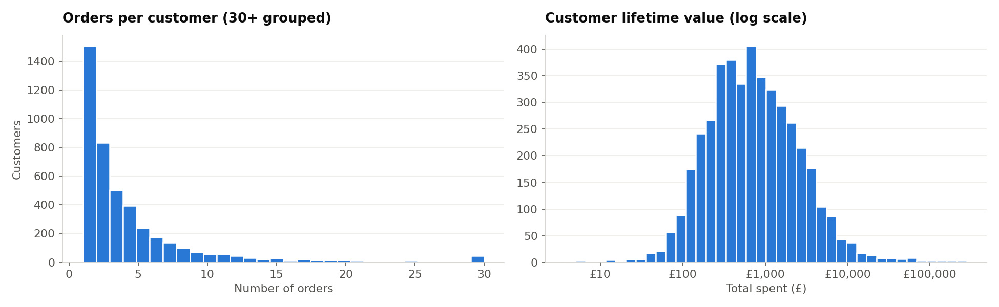
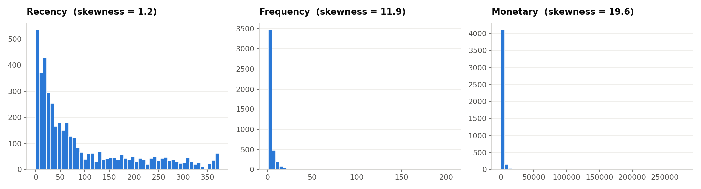
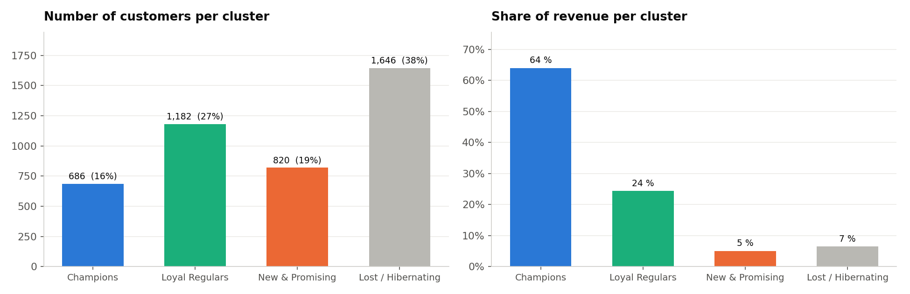

# Customer Segmentation — RFM Analysis & K-Means
**Oasis Infobyte Internship · Data Analytics · Level 1 — Task 2**  
**Author:** Ojewumi Asaph Felix

## Objective
Segment the customers of an e-commerce company according to their purchasing behaviour, and recommend a targeted marketing action for each segment.

## Dataset
- **Source:** [Online Retail](https://archive.ics.uci.edu/dataset/352/online+retail) — UCI Machine Learning Repository
- **Scope:** 541,909 invoice lines of a UK-based online gift shop, Dec 2010 – Dec 2011, amounts in £
- **File:** [`data/online_retail.csv.gz`](data/online_retail.csv.gz) — the original Excel file converted once to a compressed CSV (same content, loads ~20× faster)
- **Output:** [`data/rfm_segments.csv`](data/rfm_segments.csv) — RFM values and segment of each customer
- **Notebook:** [`customer_segmentation.ipynb`](customer_segmentation.ipynb)

## Tech Stack
Python · pandas · numpy · scikit-learn (StandardScaler, KMeans) · matplotlib · seaborn · Jupyter Notebook

## Method
1. **Cleaning**: removed lines without customer ID, cancelled invoices, zero/negative quantities and prices, duplicates and non-product codes (postage, fees). 541,909 → 391,150 lines, 4,334 customers.
2. **Descriptive statistics**: average purchase value (£475 per order), purchase frequency (median 2 orders), 12-month customer lifetime value (mean £2,016, median £663).
3. **RFM features**: Recency (days since last purchase), Frequency (orders), Monetary (£ spent).
4. **Log transform + `StandardScaler`**: Frequency and Monetary are extremely skewed (skewness 12 and 20).
5. **Elbow Method** (with silhouette score as a second check) → **K = 4**.
6. **K-Means**, scatter plots, cluster profiles and marketing recommendations.



## Segments
| Segment | Customers | Median recency | Median orders | Median spent | Share of revenue |
|---|---|---|---|---|---|
| **Champions** | 686 (16 %) | 8 days | 10 | £3,715 | **64 %** |
| **Loyal Regulars** | 1,182 (27 %) | 52 days | 4 | £1,358 | 24 % |
| **New & Promising** | 820 (19 %) | 17 days | 2 | £467 | 5 % |
| **Lost / Hibernating** | 1,646 (38 %) | 173 days | 1 | £297 | 7 % |



## Marketing recommendations
| Segment | Goal | Actions |
|---|---|---|
| Champions | Retain | VIP / loyalty programme, early access, account manager, volume discounts |
| Loyal Regulars | Upgrade to Champions | Personalised recommendations, free-shipping thresholds, loyalty tiers |
| New & Promising | Convert the 2nd and 3rd order | Welcome e-mail series, next-order discount within 30 days |
| Lost / Hibernating | Win back cheaply | One automated win-back offer, then stop spending budget |

## Limitations
- One year of data only: CLV is a 12-month value.
- 25 % of the lines had no customer ID and could not be segmented.
- K-Means borders are not strict; segments should be reviewed with the marketing team.

## Charts
| Descriptive statistics | RFM distributions | Customers & revenue per cluster |
|---|---|---|
|  |  |  |

## How to run
```bash
pip install pandas numpy scikit-learn matplotlib seaborn jupyter
jupyter notebook customer_segmentation.ipynb
```

## Demo video
_(LinkedIn link — to be added)_
