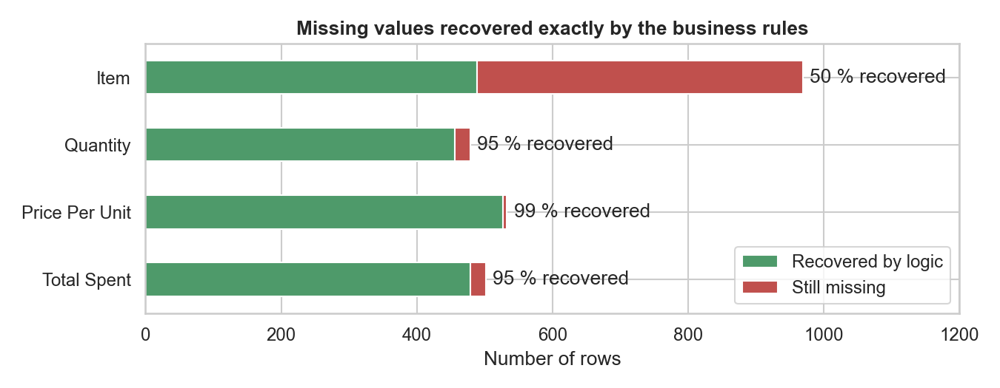
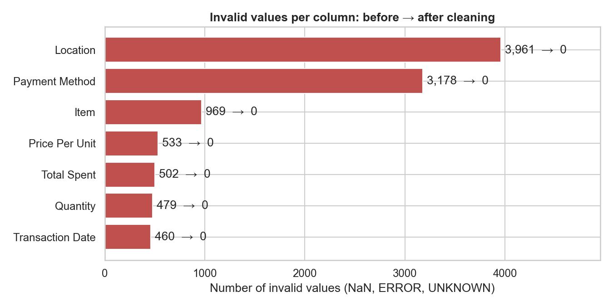
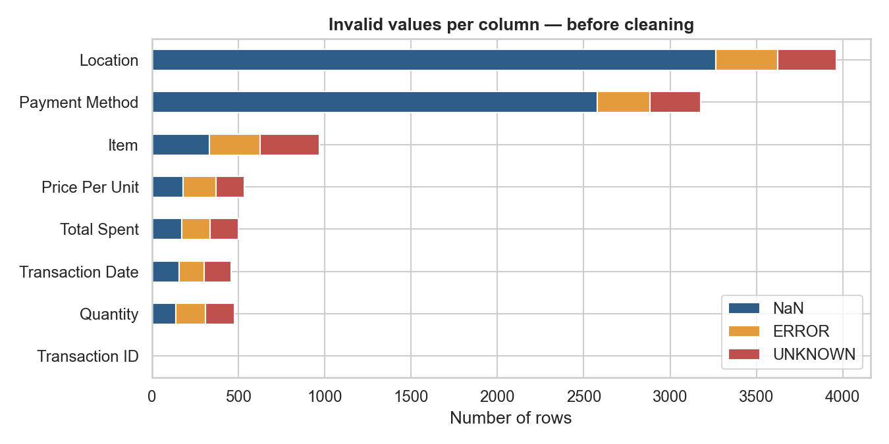
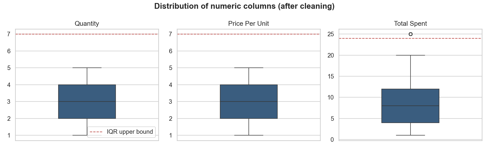
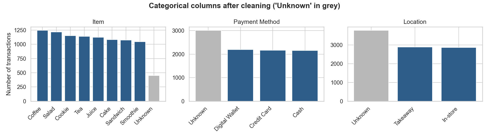

# Data Cleaning — Dirty Café Sales
**Oasis Infobyte Internship · Data Analytics · Level 1 — Task 3**
**Author:** Ojewumi Asaph Felix

## Objective
Take a deliberately messy dataset and transform it into a clean, analysis-ready dataset, documenting and justifying every decision.

## Dataset
- **Source:** *Cafe Sales — Dirty Data for Cleaning Training* (Kaggle)
- **Raw file:** [`data/raw.csv`](data/raw.csv): 10,000 transactions, 8 columns
- **Cleaned file:** [`data/cleaned.csv`](data/cleaned.csv): 9,534 transactions, 8 columns
- **Notebook:** [`data_cleaning.ipynb`](data_cleaning.ipynb)

## Tech Stack
Python · pandas · numpy · matplotlib · seaborn · Jupyter Notebook

## Steps
1. **Data quality report**: NaN, `ERROR`/`UNKNOWN` placeholders, duplicates, type issues, value ranges
2. **Standardisation**: placeholders converted to `NaN`; text normalised to canonical categories
3. **Data type correction**: numbers stored as floats/ints, dates as `datetime`, IDs as strings
4. **Missing data handling**
   - *Logical recovery* from two business rules found in the data: fixed menu prices and `Total = Quantity × Price`
   - Row deletion (missing dates), median imputation (quantity), `"Unknown"` category (item, payment, location)
5. **Duplicate removal**: checked before and after cleaning
6. **Outlier detection**: IQR and Z-score; natural extremes retained
7. **Automatic validation**: assertions on consistency, plus a reload check of the exported file
8. **Before vs. after summary** and **export**

## Results

| Metric | Before | After |
|---|---|---|
| Row count | 10,000 | 9,534 |
| Null values (NaN) | 6,826 | 0 |
| Placeholders (`ERROR` / `UNKNOWN`) | 3,256 | 0 |
| Duplicate rows / IDs | 0 / 0 | 0 / 0 |
| Columns with correct dtype | 1/8 (12%) | 8/8 (100%) |

**Key insight:** the two business rules made it possible to recover **1,951 missing values exactly**, without any guessing: 99 % of missing prices, 95 % of missing quantities and totals, and 50 % of missing item names.





## Limitations
- 460 transactions (4.6 %) were removed because their date was unknown.
- `Payment Method` (≈ 32 %) and `Location` (≈ 40 %) keep an explicit `Unknown` category.
- Cake, Juice, Sandwich and Smoothie are slightly under-counted: their missing names could not be recovered because they share a price.

## Screenshots
| Before cleaning | Outliers | Categories after cleaning |
|---|---|---|
|  |  |  |

## How to run
```bash
pip install pandas numpy matplotlib seaborn jupyter
jupyter notebook data_cleaning.ipynb
```

## Demo video
_(LinkedIn link — to be added)_
