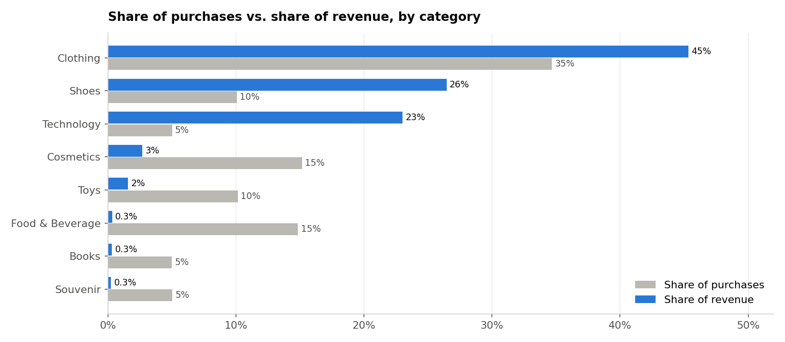
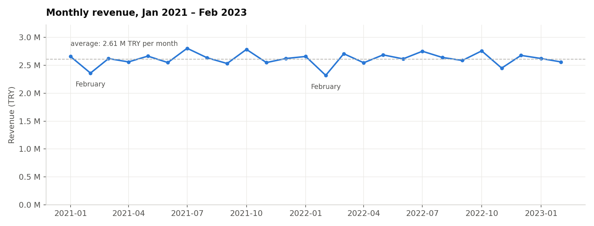
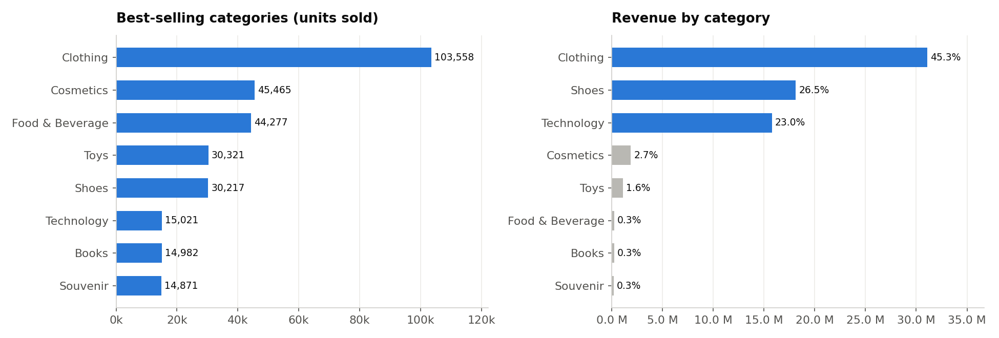
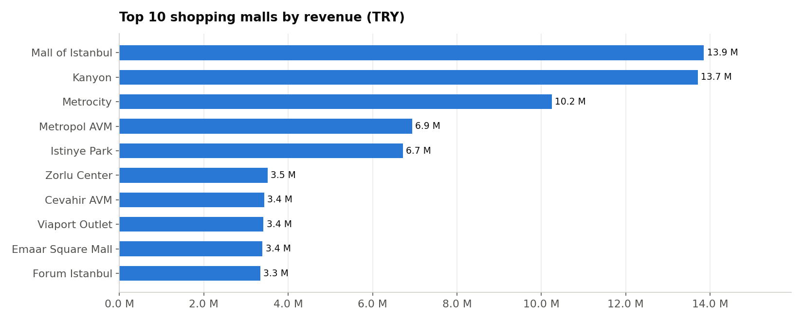
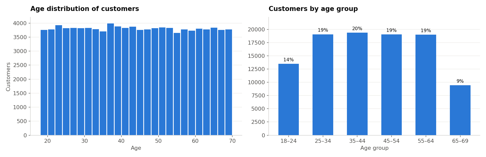
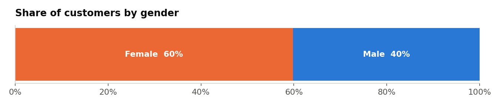
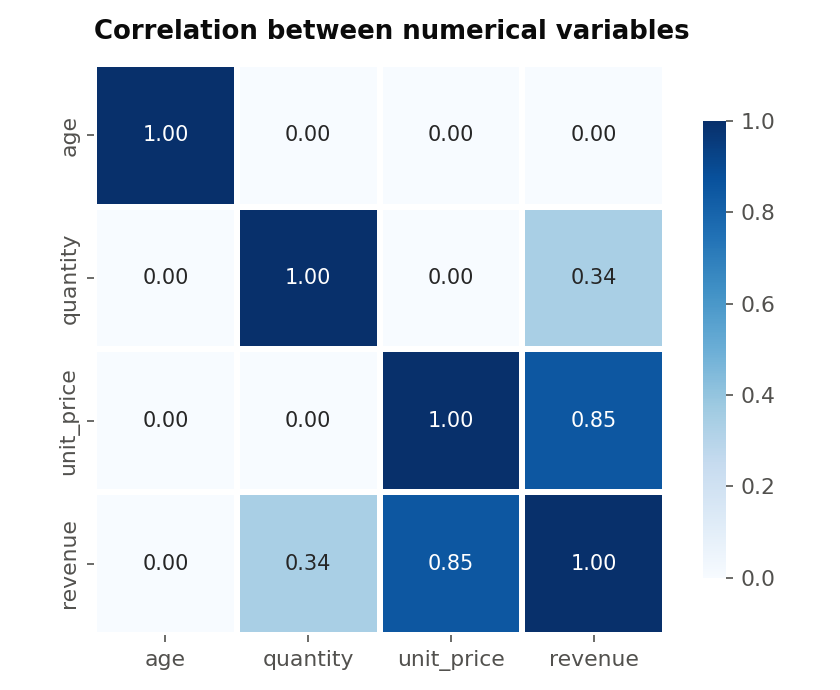

# Exploratory Data Analysis — Retail Sales in Istanbul
**Oasis Infobyte Internship · Data Analytics · Level 1 — Task 1**  
**Author:** Ojewumi Asaph Felix

## Objective
Explore a retail sales dataset to uncover sales patterns, customer behaviour and product performance, and turn them into actionable business recommendations.

## Dataset
- **Source:** *Customer Shopping Dataset — Retail Sales Data* (Kaggle)
- **File:** [`data/customer_shopping_data.csv`](data/customer_shopping_data.csv): 99,457 purchases, 10 columns
- **Scope:** 10 shopping malls in Istanbul, January 2021 – March 2023, amounts in Turkish lira (TRY)
- **Notebook:** [`eda_retail_sales.ipynb`](eda_retail_sales.ipynb)

## Tech Stack
Python · pandas · numpy · matplotlib · seaborn · Jupyter Notebook

## Analysis
1. **Data loading and inspection**: shape, types, missing values, duplicates
2. **Descriptive statistics**: mean, median, mode, standard deviation
3. **Time series analysis**: monthly and quarterly revenue
4. **Customer demographics**: age groups, gender breakdown, average basket per segment
5. **Product analysis**: best-selling categories, revenue by category, top 10 malls
6. **Correlation heatmap**
7. **Additional insight**: share of purchases vs. share of revenue by category
8. **Conclusion**: business recommendations and limitations

> **Data check:** the `price` column already contains the **line total** (unit price × quantity), since each category has one fixed unit price. Revenue is therefore `price`, not `price × quantity`: multiplying again would inflate revenue by up to 5×.

## Key findings
| | |
|---|---|
| Total revenue | **68.6 M TRY** |
| Average / median basket | **689 / 203 TRY** (right-skewed distribution) |
| Revenue concentration | **Clothing + Shoes + Technology = 95 % of revenue** with 50 % of purchases |
| Customers | **60 % women**, ages spread evenly from 18 to 69 |
| Average basket by segment | **≈ 690 TRY for every gender, age group and mall** |
| Top 3 malls | Mall of Istanbul, Kanyon, Metrocity = **55 % of revenue** |
| Trend | Stable ≈ 2.6 M TRY per month, no strong seasonality |



## Business recommendations
1. **Protect the three revenue engines** (Clothing, Shoes, Technology): stock, shelf space, promotions; instalment payments for Technology.
2. **Use frequent, low-value categories to raise the basket**: bundles and cross-selling with Food & Beverage, Cosmetics and Toys.
3. **Grow footfall in the smaller malls**: spending per visit is already the same everywhere, so growth must come from more visitors.
4. **Segment campaigns by gender and category, not by age**: age has no effect on spending.

## Limitations
- Categories only, no individual products: a true "top 10 products" is not possible.
- One purchase per customer: loyalty and repeat purchases cannot be analysed.
- Distributions are unusually uniform, suggesting partly simulated data.

## Charts
| Monthly revenue | Revenue by category | Top 10 malls |
|---|---|---|
|  |  |  |
| **Age distribution** | **Gender split** | **Correlation heatmap** |
|  |  |  |

## How to run
```bash
pip install pandas numpy matplotlib seaborn jupyter
jupyter notebook eda_retail_sales.ipynb
```

## Demo video
_(LinkedIn link — to be added)_
