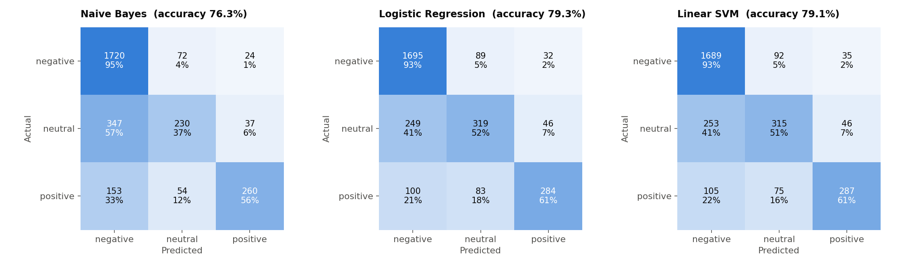
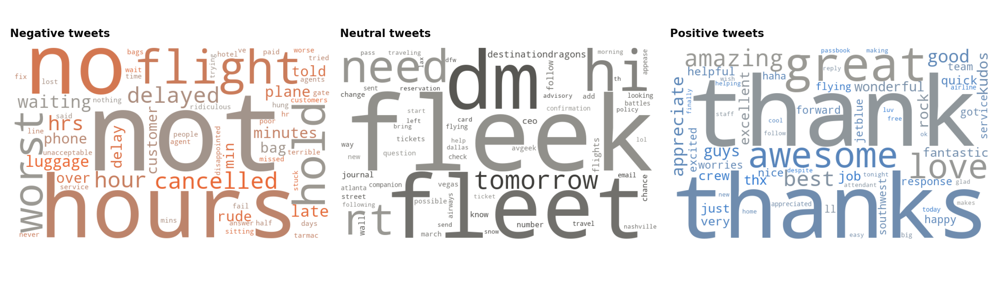

# Sentiment Analysis — Airline Customer Tweets
**Oasis Infobyte Internship · Data Analytics · Level 1 — Task 4**  
**Author:** Ojewumi Asaph Felix

## Objective
Build a machine learning model that classifies customer messages as **positive, negative or neutral**, and use it to understand what customers complain about.

## Dataset
- **Source:** *Twitter US Airline Sentiment* (Figure Eight / Kaggle, licence CC BY-NC-SA 4.0), downloaded from its [public copy on Hugging Face](https://huggingface.co/datasets/osanseviero/twitter-airline-sentiment)
- **File:** [`data/Tweets.csv`](data/Tweets.csv): 14,640 tweets sent to 6 US airlines in February 2015, labelled by human annotators
- **Notebook:** [`sentiment_analysis.ipynb`](sentiment_analysis.ipynb)

## Tech Stack
Python · pandas · scikit-learn · NLTK (Porter stemmer) · TextBlob · WordCloud · matplotlib · Jupyter Notebook

## Method
1. **Class distribution**: 63 % negative, 21 % neutral, 16 % positive (imbalanced), 155 duplicated tweets removed
2. **Preprocessing**: lowercase, remove links and @mentions, fix dataset artefacts (*"Cancelled Flightled"*), expand contractions, remove punctuation, tokenise, remove stopwords **while keeping negations** (*not, no, never*), Porter stemming
3. **TF-IDF** with unigrams and bigrams (12,492 features), fitted on the training set only
4. **Stratified 80/20 split**
5. **Models**: Naive Bayes (alpha tuned by 5-fold cross-validation), Logistic Regression, Linear SVM, compared with two baselines
6. **Evaluation**: accuracy, precision, recall, F1-score and confusion matrix per model
7. **Visualisations**: sentiment distribution, word clouds of the most *characteristic* words per class, sentiment by airline, reasons for complaints
8. **Error analysis** of 5 misclassified tweets

## Results
| Model | Accuracy | Macro F1 |
|---|---|---|
| **Logistic Regression** | **79.3 %** | **0.714** |
| Linear SVM | 79.1 % | 0.712 |
| Naive Bayes | 76.3 % | 0.662 |
| Baseline: always "negative" | 62.7 % | 0.257 |
| Baseline: TextBlob (rule-based) | 44.7 % | 0.447 |

- Negative tweets are recognised very well (recall 0.93, F1 0.88); **neutral** is the hardest class (F1 0.58).
- Main reasons for complaints: **customer service**, then late and cancelled flights.




## Data quality notes
- All tweets labelled **Delta** are actually addressed to **@JetBlue** (known error in the original dataset): no conclusion is drawn about Delta.
- The original text contains artefacts such as *"Cancelled Flightled"* or *"Late Flightr"*, corrected during preprocessing.

## Real-world application
Automatically sort incoming customer messages: send negative ones to agents first, answer neutral questions with a FAQ or chatbot, and track the daily share of negative messages as a satisfaction indicator.

## Limitations
- Sarcasm and contrast (*"used to love you, but…"*) are hard for word-based models.
- Data from 2015, US airlines only.
- A transformer model (e.g. BERT) would better understand context, especially for neutral tweets.

## How to run
```bash
pip install pandas scikit-learn nltk textblob wordcloud matplotlib jupyter
jupyter notebook sentiment_analysis.ipynb
```

## Demo video
_(LinkedIn link — to be added)_
