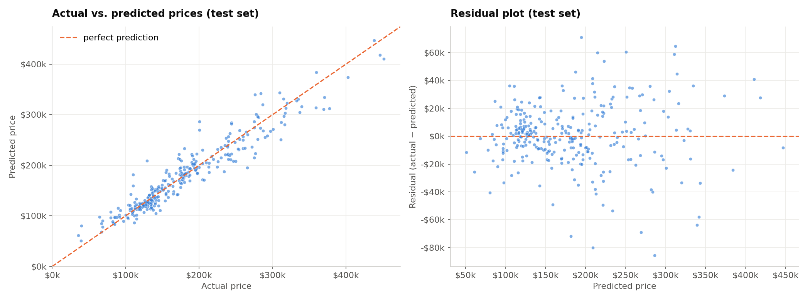
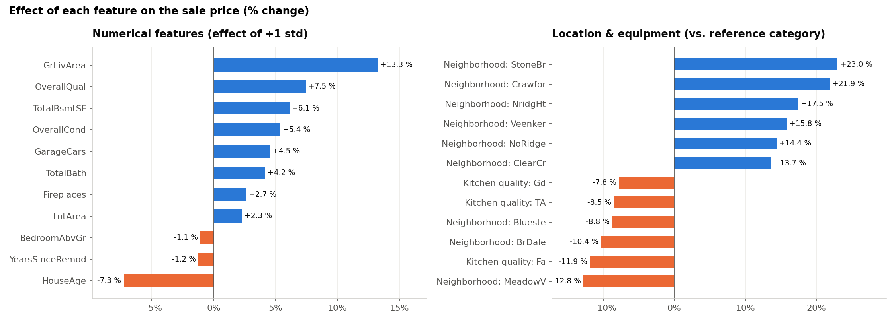
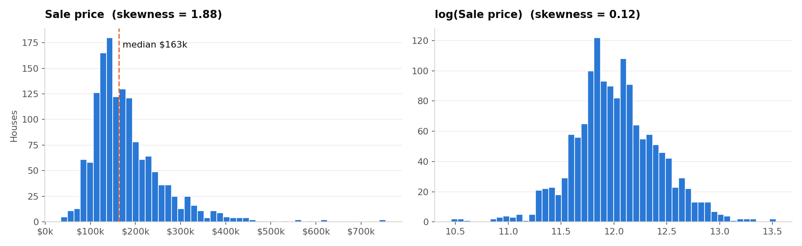
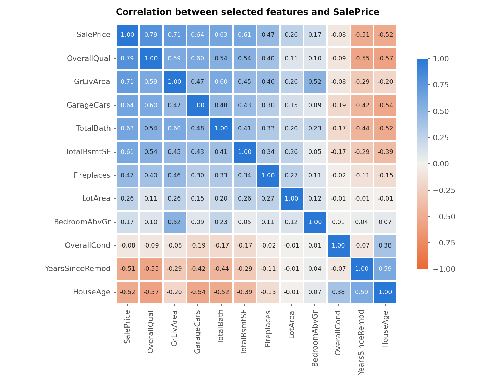
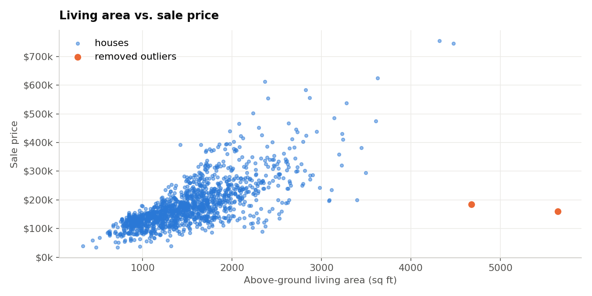

# Predicting House Prices with Linear Regression
**Oasis Infobyte Internship · Data Analytics · Level 2 — Task 1**  
**Author:** Ojewumi Asaph Felix

## Objective
Build and evaluate a linear regression model that predicts the sale price of a house from its characteristics, and understand which features drive the price.

## Dataset
- **Source:** *House Prices — Advanced Regression Techniques* (Kaggle competition, Ames Housing data by Dean De Cock), downloaded from [OpenML (dataset 42165)](https://www.openml.org/d/42165)
- **File:** [`data/house_prices.csv`](data/house_prices.csv): 1,460 houses sold in Ames, Iowa (2006–2010), 79 features, prices in US\$
- **Notebook:** [`house_price_prediction.ipynb`](house_price_prediction.ipynb)

## Tech Stack
Python · pandas · numpy · scikit-learn (LinearRegression, Ridge, Lasso, Pipeline) · matplotlib · seaborn · Jupyter Notebook

## Method
1. **EDA**: price distribution (skewness 1.88 → **log transform**, skewness 0.12)
2. **Missing values**: most "missing" values mean *absence* (no pool, no garage, no basement) → filled with `"None"`/0; `LotFrontage` → median of the neighbourhood
3. **Feature selection** (14 features): quality, size, rooms & equipment, age (new features `HouseAge`, `YearsSinceRemod`, `TotalBath`), location (`Neighborhood`), avoiding redundant features
4. **Correlation heatmap**
5. **Outliers**: 2 very large houses sold at abnormally low prices removed (recommended by the dataset's author)
6. **One-Hot Encoding + standardisation** in a scikit-learn pipeline, **80/20 split**
7. **Linear Regression**, evaluated with **MSE, RMSE, R²** (and MAE), actual vs. predicted and residual plots
8. **Coefficient analysis** (effects expressed in % of price)
9. **Bonus**: Ridge and Lasso on all 79 features

## Results
| Model | R² | RMSE | MAE |
|---|---|---|---|
| **Linear Regression (14 features)** | **0.909** | **\$22,389** | **\$16,083** |
| Linear Regression (all features) | 0.913 | \$21,906 | \$15,554 |
| Ridge (all features) | 0.927 | \$20,040 | \$14,600 |
| Lasso (all features) | 0.931 | \$19,542 | \$14,166 |



## What drives the price?
- **Living area** (+13 % per +505 sq ft) and **overall quality** (+7.5 % per +1.4 points); **age** −7 % per 30 years
- **Location**: *StoneBr* +23 %, *Crawfor* +22 %, *NridgHt* +18 % vs. the reference neighbourhood; *MeadowV* −13 %
- **Kitchen quality** (fair: −12 % vs. excellent) and **central air** (+9 %)
- More bedrooms at the same living area → slightly **lower** price: buyers pay for space



## Business use
Suggest a listing price, detect over- or under-priced houses, and show sellers which renovations add the most value.

## Limitations
One city and period (Ames, 2006–2010); high-end houses are less well predicted; linear models do not capture complex interactions.

## Charts
| Price distribution | Correlation heatmap | Outliers |
|---|---|---|
|  |  |  |

## How to run
```bash
pip install pandas numpy scikit-learn matplotlib seaborn jupyter
jupyter notebook house_price_prediction.ipynb
```

## Demo video
_(LinkedIn link — to be added)_
