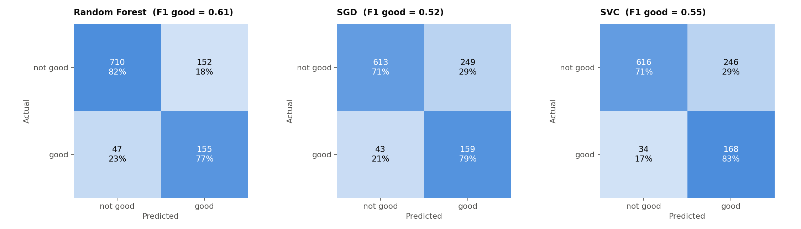
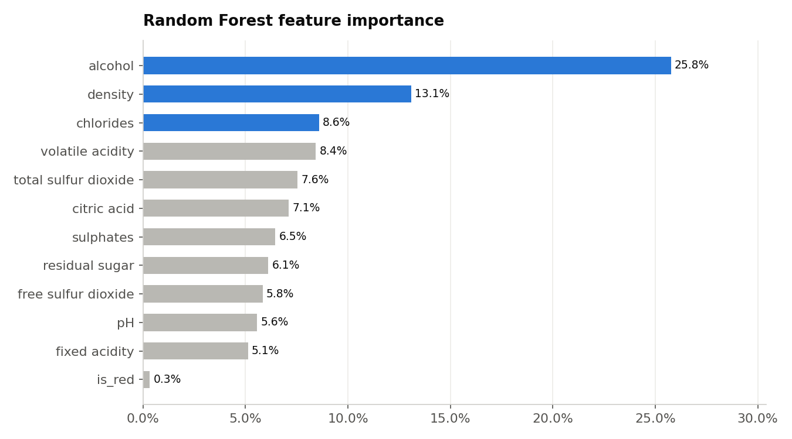
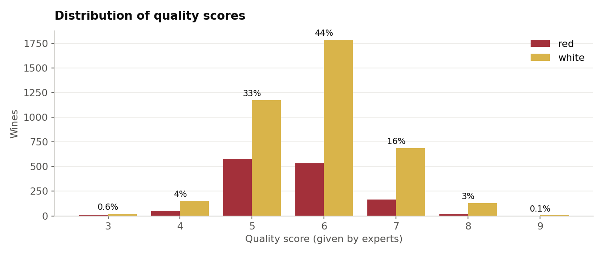
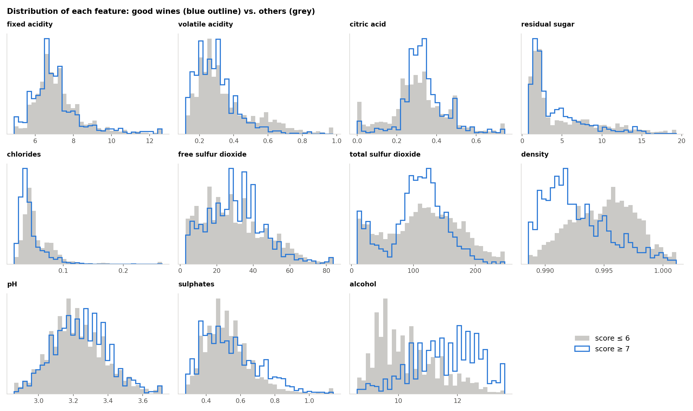
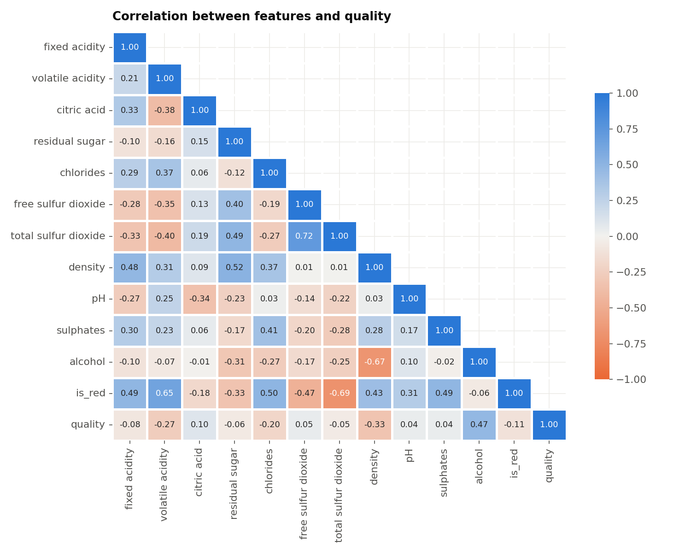

# Wine Quality Prediction
**Oasis Infobyte Internship · Data Analytics · Level 2 — Task 2**  
**Author:** Ojewumi Asaph Felix

## Objective
Predict the quality of a wine from its physicochemical properties and compare three classifiers: **Random Forest, Stochastic Gradient Descent (SGD) and Support Vector Classifier (SVC)**.

## Dataset
- **Source:** [Wine Quality](https://archive.ics.uci.edu/dataset/186/wine+quality) — UCI Machine Learning Repository (Cortez et al., 2009)
- **Files:** [`data/winequality-red.csv`](data/winequality-red.csv) (1,599 red wines) and [`data/winequality-white.csv`](data/winequality-white.csv) (4,898 white wines) — Portuguese *Vinho Verde*, 11 lab measurements + expert quality score (0–10)
- **Notebook:** [`wine_quality_prediction.ipynb`](wine_quality_prediction.ipynb)

## Tech Stack
Python · pandas · numpy · scikit-learn (RandomForestClassifier, SGDClassifier, SVC, GridSearchCV) · matplotlib · seaborn · Jupyter Notebook

## Method
1. **Inspection**: red and white wines combined (`is_red` feature), no missing values, **1,177 duplicated wines removed** → 5,320 unique wines
2. **EDA**: distribution of every chemical feature (good vs. other wines), correlation heatmap
3. **Class imbalance**: 77 % of wines are rated 5 or 6; scores 3 and 9 are extremely rare
4. **Feature engineering**: 3-class option tested (only 64 % accuracy — scores 5 and 6 overlap), **binary target chosen: good (≥ 7) vs. not good**, answering "is this a premium wine?" (19 % good)
5. **Stratified 80/20 split**, `class_weight="balanced"`, hyper-parameters tuned by **5-fold cross-validation** on the F1-score of the "good" class
6. **Evaluation**: accuracy, classification report, confusion matrix, Random Forest feature importance, comparison table

## Results
| Model | Accuracy | Precision (good) | Recall (good) | F1 (good) |
|---|---|---|---|---|
| **Random Forest** | **81.3 %** | **0.51** | 0.77 | **0.61** |
| SVC | 73.7 % | 0.41 | 0.83 | 0.55 |
| SGD | 72.6 % | 0.39 | 0.79 | 0.52 |



**Most important features:** alcohol (26 %), density (13 %), chlorides and volatile acidity (≈ 8.5 % each). Wine type matters almost nothing once the chemistry is known.



**Why removing duplicates mattered:** with duplicates, 396 of the 1,300 test wines were already in the training set, inflating the Random Forest's accuracy from 81.3 % to 84.1 % (data leakage).

## Conclusion
**Random Forest is the most suitable model for deployment**: best F1 and accuracy, far fewer false alarms than SGD and SVC, captures non-linear effects without scaling, and is explainable through feature importance. It can be used as a **first screening tool** to send the most promising wines to the tasting panel.

**Limitations:** subjective expert scores, only 11 chemical measurements (no grape variety, vintage or price), one wine region.

## Charts
| Quality scores | Feature distributions | Correlation heatmap |
|---|---|---|
|  |  |  |

## How to run
```bash
pip install pandas numpy scikit-learn matplotlib seaborn jupyter
jupyter notebook wine_quality_prediction.ipynb
```

## Demo video
_(LinkedIn link — to be added)_
